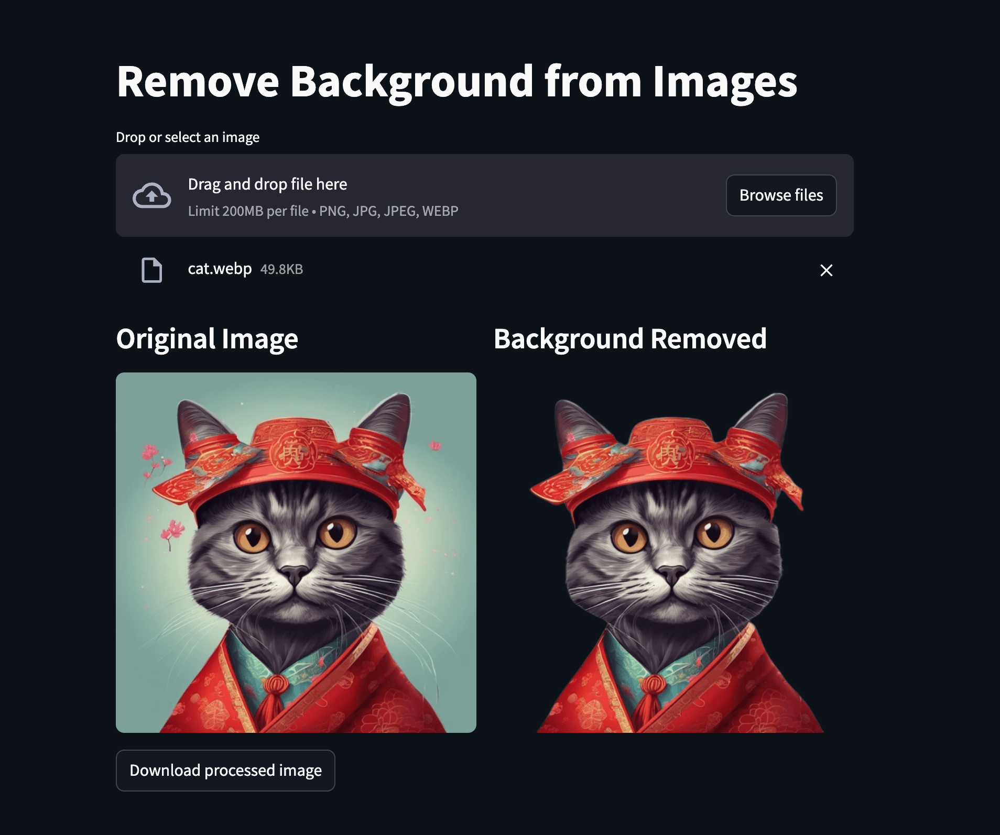

# Image Background Removal App 🖼️✂️

A Streamlit web application that removes backgrounds from images using the `rembg` library. Upload any image and get a clean, background-removed version instantly.

## Features

- Simple and intuitive user interface
- Supports multiple image formats (PNG, JPG, JPEG, WebP)
- Real-time background removal
- One-click download of processed images
- Optimized for performance with model caching

## Demo



## Installation

### Using Docker (Recommended)

1. Clone the repository:
```bash
git clone https://github.com/krishangupta33/background_remover.git
cd rmbg
```

2. Download the U2Net model:
- Download [u2net.onnx](https://github.com/danielgatis/rembg/releases/download/v0.0.0/u2net.onnx)
- Place it in the project root directory

3. Build and run the Docker container:
```bash
docker build -t rmbg .
docker run -p 8501:8501 rmbg
```

4. Open your browser and navigate to `http://localhost:8501`

### Manual Installation

1. Clone the repository:
```bash
git clone https://github.com/krishangupta33/rmbg.git
cd rmbg
```

2. Create and activate a virtual environment (optional but recommended):
```bash
python -m venv venv
source venv/bin/activate  # On Windows: venv\Scripts\activate
```

3. Install the required packages:
```bash
pip install -r requirements.txt
```

4. Run the application:
```bash
streamlit run app.py
```

## Requirements

- Python 3.9+
- Streamlit
- rembg
- Pillow
- See `requirements.txt` for complete list

## Usage

1. Open the application in your web browser
2. Click "Drop or select an image" to upload your image
3. Wait for the background removal process to complete
4. Download the processed image using the "Download processed image" button

## Contributing

Feel free to open issues or submit pull requests if you have any improvements or bug fixes.

## License

[Add your license information here]

## Acknowledgments

- [rembg](https://github.com/danielgatis/rembg) for the background removal functionality
- [Streamlit](https://streamlit.io/) for the web application framework

## Developer

Developed by [Krishan Gupta](https://github.com/krishangupta33)# image_background-remover-docker-app
